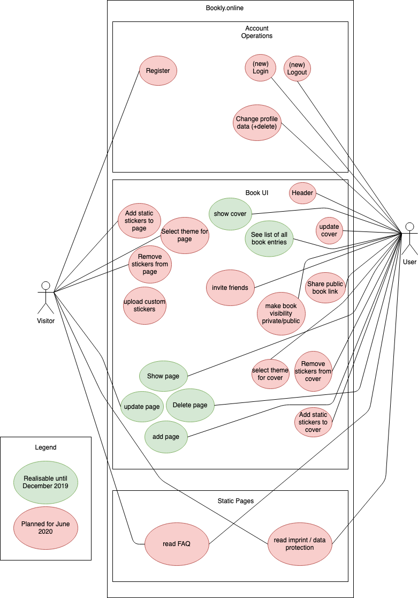

# BOOKLY - Software Requirements Specification

## Table of Contents

-   [BOOKLY - Software Requirements Specification](#BOOKlY---software-requirements-specification)

    -   [Table of Contents](#table-of-contents)

    -   [1. Introduction](#1-introduction)

        -   [1.1 Purpose](#11-purpose)
        -   [1.2 Scope](#12-scope)
        -   [1.3 Definitions, Acronyms and Abbreviations](#13-definitions-acronyms-and-abbreviations)
        -   [1.4 References](#14-references)
        -   [1.5 Overview](#15-overview)

    -   [2. Overall Description](#2-overall-description)

		-   [2.1 Product perspective](#21-product-perspective)
		-   [2.2 Product functions](#22-product-functions)
        -   [2.3 User characteristics](#23-user-characteristics)
        -   [2.4 Dependencies](#24-dependencies)
		-	[2.5 Constraints](#25-constraints)

    -   [3. Specific Requirements](#3-specific-requirements)

        -   [3.1 Functionality – Data Backend](#31-functionality--data-backend)

            -   [3.1.1 Read data given over API endpoints](#311-read-data-given-over-api-endpoints)
            -   [3.1.2 Parse data](#312-parse-data)
            -   [3.1.3 Provide data](#313-provide-data)

        -   [3.2 Functionality – User Interface](#32-functionality--user-interface)

            -   [3.2.1 User system](#321-user-system)
            -   [3.2.2 Friendship book](#322-friendship-book)

        -   [3.3 Usability](#33-usability)

        -   [3.4 Reliability](#34-reliability)

            -   [3.4.1 Availability](#341-availability)
            -   [3.4.2 MTBF, MTTR](#342-mtbf-mttr)
            -   [3.4.3 Accuracy](#343-accuracy)
           
        -   [3.5 Performance](#35-performance)

            -   [3.5.1 Response time](#351-response-time)
            -   [3.5.2 Throughput](#352-throughput)
            -   [3.5.3 Capacity](#353-capacity)
           
        -   [3.6 Supportability](#36-supportability)

        -   [3.7 Design Constraints](#37-design-constraints)

            -   [3.7.1 Development tools](#371-development-tools)
            -   [3.7.2 Spring Boot](#372-spring-boot)
            -   [3.7.3 Supported Platforms](#373-supported-platforms)

        -   [3.8 Online User Documentation and Help System Requirements](#38-online-user-documentation-and-help-system-requirements)

        -   [3.9 Purchased Components](#39-purchased-components)

        -   [3.10 Interfaces](#310-interfaces)

            -   [3.10.1 User Interfaces](#3101-user-interfaces)
            -   [3.10.2 Hardware Interfaces](#3102-hardware-interfaces)
            -   [3.10.3 Software Interfaces](#3103-software-interfaces)
            -   [3.10.4 Communications Interfaces](#3104-communications-interfaces)

        -   [3.11 Licensing Requirements](#311-licensing-requirements)

        -   [3.12 Legal, Copyright and other Notices](#312-legal-copyright-and-other-notices)

        -   [3.13 Applicable Standards](#313-applicable-standards)

    -   [4. Supporting Information](#4-supporting-information)

## 1. Introduction
Do you still remember the friendship book from your childhood days? Whoever had the most pages and the greatest entries was highly regarded. It was handcrafted, painted, drawn and designed.As books become less important with digitalization, we want to maintain the old charm of friendship books and bring back the fun of designing and collecting.
### 1.1 Purpose

The purpose of this document is a general description of the bookly project. It explains our vision and all features of the product. Also it offers insights into the system of back- and frontend, the interfaces in both ends for communication and the constraints of the product.

### 1.2 Scope

This document is designed for internal use only and will outline the development process of the project.The idea shall be realized within a website. Depending on the progress, the same or reduced functions should also be implemented as an Android app.

**Subcomponents**
-	Account
	-	Registering, managing, deleting account, Login and Logout to our Application.
-	Connecting People
	-	Opportunity to share the friendship book with friends by sending a link for editing a page.
-	Overview
	-	View of the friendship book with all pages and entries.
	-	Edit friendship book
	-	Edit cover, delete friendship book pages, add page (data input only) 
-	Static Pages
	-	FAQ
	-	Impressum
	-	DSGVO
	-	Kontakt
-	Friend Entry
	-	Possibility to create new entries and to share them with friends
-	Individual Themes
	-	Choose your own theme and design it by extending it with stickers, pictures and text.

### 1.3 Definitions, Acronyms and Abbreviations

| Term     |                                     |
| -------- | ----------------------------------- |
| **SRS**  | Software Requirements Specification |
| **JSON** | JavaScript Object Notation          |
| **MTBF** | Mean Time Between Failures          |
| **MTTR** | Mean Time To Repair                 |
| **API**  | Application Programming Interface   |
| **FAQ**  | Frequently Asked Questions          |
| **REST** | Representational State Transfer     |

### 1.4 References

| Title                                                                                                 | Date       |
| ----------------------------------------------------------------------------------------------------- | ---------- |
| [Blog](https://blog.bookly.online/)                                                                   | 17/10/2019 |
| [Gitlab](https://gitlab.com/project_bookly/)                                                          | 17/10/2019 |
| [Use Case Diagram](design/usecase.png)                                                                | 17/10/2019 |
| [Youtrack](https://nicoschinacher.myjetbrains.com/youtrack/agiles)                                    | 02/12/2019 |
| <a href="https://sonarqube.bookly.online">SonarQube</a>			                                    | 29/5/2020  |
| <a href="https://bookly.online">bookly.online</a>			                                            | 29/5/2020  |
| <a href="https://bookly.online">dev.bookly.online</a>			                                        | 29/5/2020  |
| <a href="https://bookly.online">keycloak.bookly.online</a>			                                | 29/5/2020  |

### 1.5 Overview

The next chapters provide information about our vision based on the use case diagram as well as more detailed 
software requirements.

## 2. Overall Description

### 2.1 Product perspective

The product is supposed to be an open source. It is a web based system implementing client-server model. Bookly 
provides a friendship book from the old days.

The following are the main features that are included in the bookly website.

-	User account/interface: The system allows the user to create their accounts in the system and provide features 
of updating and viewing profiles. You can view your friendship and invite friends to design a page.
-	Number of users being supported by the system: Though the number is precisely not mentioned but the system is 
able to support a large number of online users at a time.

### 2.2 Product functions

At registration, the data provided by the user is stored in the backend. It is needed to log in, edit the profile and also provides the basis for a permission-system. According use cases are:
-	User System: login, register, invite friends, logout, edit, close account

A user can give permissions to other users so they’re able to design a new page in the friendship book. Users are able to design their own friendship book covers. According use cases are:
-	friendship book: design cover, upload custom images, edit title, delete/add pages
-	page: add entries, add cover image, add stickers, share page

Additional content:
- footer and header for navigation and additional information

**Our Use-Case-Diagram**

### 2.3 User characteristics

It is basically for everyone who feels nostalgic and wants to dwell in the memories of their childhood. 
Nevertheless, our main target group consists of children. 

### 2.4 Dependencies

The project has the dependencies that are due to our choice in technology. 
Requirements subsets
-	VM with debian buster
-   Apache2 webserver
-   Wordpress
-	Domain
-   Docker
-   Java (including Jacoco, Maven, Lombok, SpringBoot, Hibernate JPA, Swagger, Cucumber, JUnit, Mockito)
-   VueJS (including Bootstrap)
-	GitLab (including CI)
-	IntelliJ IDE
-	YouTrack
-   Keycloak (including OAuth2 Module for SpringBoot and VueJS)
-   PostgreSQL (including PgAdmin)
-   SonarQube
-   H2

### 2.5 Constraints
Our database limit is under 15 GB. We have 2 Servers with 2GB RAM each.
The metrics server and the blog are seperated from the application server.

## 3. Specific Requirements
This section contains all of the functional and quality requirements of the system. It gives a detailed description 
of the system and all its features. In the following sections our standard requirements for our functions are described. 
If they vary, these functions will be explained explicitly. 
### 3.1 Functionality – Data Backend

The backend is needed to separate the user interface from the data storage. It verifies if the correct permissions 
are present to request data or to ensure that incoming data is properly parsed and saved correctly. For security 
reasons data is filtered by the backend. It is then packed in the right format which the next chapter describes. The 
data is kept inside a database and maintained by the backend.

#### 3.1.1 User system
For the identity management we are using Keycloak. There we have the opportunity to login/logout/register/delete an user.
Additional information about a user that uses our application we store the data in our application too and are synchronising the data.
The According use cases:

-   [Operate Account](design/OperateAccount.md)
-   [Navigate Header](design/NavigateHeader.md)
-   [Navigate Footer](design/NavigateFooter.md)

#### 3.1.2 Friendship book

A friendship book consists of a cover and friendship book entries. These entries can be created by the friendship book owner and can be edited public by a friend.
According use cases are:

-   [Manage book pages/entries](design/ManagePage.md "Manage book pages/entries")
-   [Manage book](design/ManageBook.md "Manage book")
-   [Share link, Visibility & Invite](design/sharelink_visibility_invite.md)
-   [Manage page decorations](design/design_Manage_Page_Decorations.md)
-   [Manage cover decorations](design/design_Manage_Cover_Decorations.md)

#### 3.1.3 Read data given over API endpoints

For the communication between both sides (frontend and backend) a universal data format is needed, therefore JSON is 
used. The frontend sends data in JSON to the backend in form of a request and waits for a response from the backend 
which also answers with JSON.

#### 3.1.4 Parse data

Incoming data needs to be checked if the sent values represent the correct data type and if the user that sends the 
request has the permissions to do so. 
#### 3.1.5 Provide data

After data is requested from the frontend and the user is authorised to do so, the backend sends data. In addition, 
the response contains a HTTP status code even if the request failed so that the frontend knows if it just received 
data or an error.

### 3.2 Functionality – User Interface

The frontend provides an user interface for the users to interact with and is able to request data from the data backend.

### 3.3 Usability

We will build the user interface intuitive, so that a new user does not necessarily need an explanation. If questions 
arise our interface provides a comprehensive FAQ. 
### 3.4 Reliability

In the following we describe the availability, MTBF and MTTR, accuracy and bug classes we strive for.

#### 3.4.1 Availability

Since we are trying to focus on a bug free application rather than caring about hosting it on our own, the availability 
depends on the hosting
provider we choose. Due redundancy and other security arrangements, most providers can ensure an uptime over 99.9% of 
the time its hosted at their datacenter.

#### 3.4.2 MTBF, MTTR

If the application fails due an hardware issue, then the mean times are up to our hosting provider. Since the ensured 
uptime of most hosting providers
is 99.9%, they try to fix the issue within a few minutes.
However, if the application fails due a bug in our code, we can revert the code to a previous version that worked fine. 
This shouldn't take more than
one or two hours from the point on we noticed.

#### 3.4.3 Accuracy

-	N\A

### 3.5 Performance

In general, we try to keep to user experience fluent and response times low. High peaks can still appear when the 
hosting provider is currently having issues.

#### 3.5.1 Response time

Should be as low as possible. Maximum response time is 3 seconds. Average response time should be less than 1 second.

#### 3.5.2 Throughput
Should be as large as possible.

#### 3.5.3 Capacity

The current system should be capable to manage 100k of registered users and up to 1k users at the same time.

### 3.6 Supportability

Our frontend, backend and each functionality will be clearly separated and we try to stick to naming conventions 
which are common in the used technologies.
Furthermore we aim to keep our code clean which we can't guarantee though. Thereby we make it easy to understand 
our infrastructure and avoid possible confusion
when one needs to edit older parts of the application.

### 3.7 Design Constraints

We are focused on building a modern-looking application using modern technologies. Of course there are other 
smaller libraries and frameworks used than the ones that
are listed, but they represent just a small fraction of the whole project and aren't worth mentioning.

#### 3.7.1 Development tools

-   Git: version control system
-   JetBrains IntelliJ: Spring MVC backend development (including Swagger) and Vue.js frontend development
-   YouTrack: Project planning tool
-	Database: H2 (local), Postgres (prod)
-	Browser: Firefox, Chrome

#### 3.7.2 Spring Boot

Spring Boot is built on top of the Spring framework and provides the developer with helpful features to create and 
run web applications. In our case, a REST Web Service
which represents the interface between our front- and backend. As we want to benefit from the newest features of Java 8, 
the platform this service will be hosted on needs to support Java 8.

#### 3.7.3 Supported Platforms

Since bookly will be a web application the user only needs a modern web browser and a stable internet connection. With 
modern web browser we mean the
current versions of Mozilla Firefox or Google Chrome.

### 3.8 Online User Documentation and Help System Requirements

We want to provide a small F.A.Q. for possible questions that can come up when using our application. Since it can be 
frustrating for children if they don't know what to do we will include step-by-step
instructions and enough pictures to show the user exactly what to click at.

### 3.9 Purchased Components

-   N\A

### 3.10 Interfaces

#### 3.10.1 User Interfaces

Our User Interface will provide one page for each implemented functionality.
To navigate between these sites the user will find a menu bar at the top.

#### 3.10.2 Hardware Interfaces

-   N\A

#### 3.10.3 Software Interfaces

Our backend implements a REST-API, whose URLs our frontend can invoke with Http-Requests.
We will prepare base URLs for data concerning the user. 
For each friendship book base URL one can choose to either leave it public or private.
These data will be processed by our backend and then passed to our database.
The connection between our backend and the database will be managed by H2.

#### 3.10.4 Communications Interfaces

Each HTTP-Request and Response contains a JSON.
By  interpreting its content our system will be able to transfer all needed data between front- and backend.

### 3.11 Licensing Requirements

Our project runs under the MIT License. This way everyone is allowed to create his own version.

### 3.12 Legal, Copyright and other Notices

-   N\A

### 3.13 Applicable Standards

-   N\A

## 4. Supporting Information

For a better overview, watch the table of contents and/or references.
