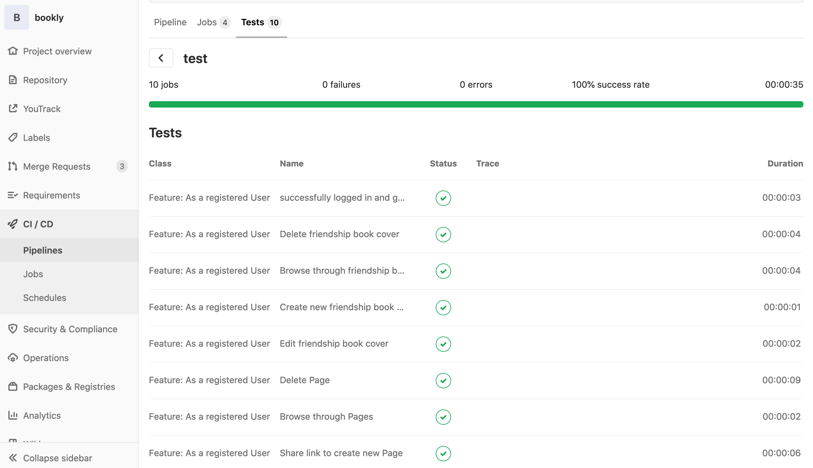
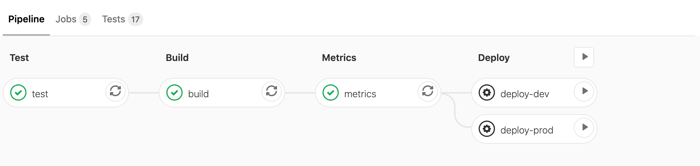

# Test plan

## 1.	Introduction
### 1.1	Purpose
The purpose of the Iteration Test Plan is to gather all of the information necessary to plan and control the test effort for a given iteration. 
It describes the approach to testing the software.
This Test Plan for vnv supports the following objectives:
-	Identifies the items that should be targeted by the tests.
-	Identifies the motivation for and ideas behind the test areas to be covered.
-	Outlines the testing approach that will be used.
-	Identifies the required resources and provides an estimate of the test efforts.

### 1.2	Scope
This document describes the used tests, as they are unit tests and functionality testing.

### 1.3	Intended Audience
This document is meant for internal use primarily.

### 1.4	Document Terminology and Acronyms
- **SRS**	Software Requirements Specification
- **n/a**	not applicable
- **tbd**	to be determined

### 1.5	 References
| Reference        | 
| ------------- |
| [Blog](https://blog.bookly.online/) | 
| [SAD](https://gitlab.com/project_bookly/bookly/blob/master/sad.md) | 
| [Function Points](https://docs.google.com/spreadsheets/d/1CUD7vvflKn4G5ev69hePuDrN53YdeqnRC2GNkmY2Lxk/edit#gid=0) |
| [UC1 Create Book](https://gitlab.com/project_bookly/bookly/blob/master/design/design_CreateBook.md)|
| [UC2 Read Book](https://gitlab.com/project_bookly/bookly/blob/master/design/ReadBook.md)|
| [UC3 Update Book](https://gitlab.com/project_bookly/bookly/blob/master/design/ManageBook.md)|
| [UC4 Create Page](https://gitlab.com/project_bookly/bookly/blob/master/design/CreatePage.md)|
| [UC5 Read Page](https://gitlab.com/project_bookly/bookly/blob/master/design/ReadPage.md)|
| [UC6 Update Page](https://gitlab.com/project_bookly/bookly/blob/master/design/EditPage.md)|
| [UC7 Share Link Visibility Invite](https://gitlab.com/project_bookly/bookly/-/blob/master/design/sharelink_visibility_invite.md)|
| [UC8 Manage Page Decorations](https://gitlab.com/project_bookly/bookly/-/blob/master/design/design_Manage_Page_Decorations.md)|
| [UC9 Manage Cover Decorations](https://gitlab.com/project_bookly/bookly/-/blob/master/design/design_Manage_Cover_Decorations.md)|
| [UC10 Navigate Footer](https://gitlab.com/project_bookly/bookly/-/blob/master/design/NavigateFooter.md)|
| [UC11 Navigate Header](https://gitlab.com/project_bookly/bookly/-/tree/master/design/NavigateHeader.md)|
| [UC12 Operate Account](https://gitlab.com/project_bookly/bookly/-/tree/master/design/OperateAccount.md)|

## 2.	Evaluation Mission and Test Motivation
### 2.1	Background
By testing our project, we make sure that all changes to the sourcecode do not break the functionality. Also by integrating the test process in our deployment process, we make sure that only working versions of our project getting deployed. So the web application is always available.
### 2.2	Evaluation Mission
Our motivation in implementing tests came at an early stage to recognize the need for errors and to ensure the functionality and thus the outstanding quality of the software.
### 2.3	Test Motivators
Our testing is motivated by 
- quality risks 
- technical risks, 
- use cases 
- functional requirements

## 3.	Target Test Items
The listing below identifies those test items (software, hardware, and supporting product elements) that have been identified as targets for testing. 
This list represents what items will be tested. 

Items for Testing:
- java backend
- field test
- database operations

## 4.	Outline of Planned Tests
### 4.1	Outline of Test Inclusions
Unit testing the Java backend, functional testing of the Web frontend and database integrity
### 4.2	Outline of Other Candidates for Potential Inclusion
Stress testing the application
### 4.3 Outline of Test Exclusions
What we are not planning to do is attack simulation. 

## 5.	Test Approach
### 5.1 Initital Test-Idea Catalogs and Other Reference Sources
**n/a**
### 5.2	Testing Techniques and Types
#### 5.2.1	Database Integrity Testing
|| |
|---|---|
|Technique Objective  	| The connection with the database shall be opened. Data shall be created, deleted, updated or read without any problem. |
|Technique 		|  Authentication will be mocked. Any service method or database request will be tested by using the local runtime database H2  |
|Oracles 		|  The database connection is possible and the database user has all privileges he needs. |
|Required Tools 	| JUnit + Mockito, H2 |
|Success Criteria	|    successful scenarios, all tests will pass, no strange behaviour will occur         |
|Special Considerations	|     -          |

#### 5.2.2 Function Testing
|| |
|---|---|
|Technique Objective  	| Every service request shall be done correctly. Possible exceptions are caught correctly. |
|Technique 		|  Cucumber tests are doing the integration testing, Unit tests for the backend are done by JUnit and Mockito  |
|Oracles 		|  user enter valid data, for example a valid username and a valid password  |
|Required Tools 	| Cucumber + JUnit	 |
|Success Criteria	|    successful scenarios, all tests will pass, no strange behaviour will occur         |
|Special Considerations	|     -          |

#### 5.2.3 Business Cycle Testing
**n/a**

#### 5.2.4 User Interface Testing
**n/a**

#### 5.2.5 Performance Profiling 
**n/a**

#### 5.2.6 Load Testing
**n/a**

#### 5.2.7 Stress Testing
**n/a**

#### 5.2.8	Volume Testing
**n/a**

#### 5.2.9	Security and Access Control Testing
**n/a**

#### 5.2.10	Failover and Recovery Testing
**n/a**

#### 5.2.11	Configuration Testing
**n/a**

#### 5.2.12	Installation Testing
**n/a**

#### 5.2.13	Field Testing
|| |
|---|---|
|Technique Objective  	| The whole application shall be tested by a real user. |
|Technique 		|  Before the field test will start, the developing team will test the application by themselves, too. Each user can then try out the website on his own. We can ask or answer further questions while he/she is testing the application   |
|Oracles 		|  user uses the website exactly as we do, user enters data in the expected format  |
|Required Tools 	| Multiple computers, chatting tool for remote support, support from parents or teachers, mail-address required|
|Success Criteria	|    Feedback, finding bugs, no strange behaviour will occur |
|Special Considerations	|     -          |

## 6.	Entry and Exit Criteria
### 6.1	Test Plan
#### 6.1.1	Test Plan Entry Criteria
Building a new version of the software with Gitlab-CI will execute the testprocess.
#### 6.1.2	Test Plan Exit Criteria
When all tests pass without throwing an exception.
#### 6.1.3 Suspension and Resumption Criteria
It will be possible to skip the tests for faster deployment during development.
Apart from that the tests will always run till the end.

## 7.	Deliverables
### 7.1	Test Evaluation Summaries
Test evaluation will be available online every time the tests are run in gitlab. The report is generated with the help of surefire and jacoco.
Detailed test results are available within every pipeline. 

### 7.2	Reporting on Test Coverage
Test coverage numbers will be generated by jacoco and gitlab. 
The current coverage status of the master branch: 
### 7.3	Perceived Quality Reports
We are using sonarqube for metrics. After every push to gitlab a pipeline is triggered that is updating the metrics on sonarqube.

If one wants a specific metric report of a branch or commit one should repeat the specific pipeline.

### 7.4	Incident Logs and Change Requests
With the help of the above tools we will integrate a check into gitlab for pull requests.
### 7.5	Smoke Test Suite and Supporting Test Scripts
**n/a**
### 7.6	Additional Work Products
#### 7.6.1	Detailed Test Results
Detailed test results are available within every pipeline. 

The test coverage of the whole project can be found here: [Coverage](https://gitlab.com/project_bookly/bookly/-/blob/master/README.md "Coverage")

#### 7.6.2	Additional Automated Functional Test Scripts
**n/a**
#### 7.6.3	Test Guidelines
In general all testable code should be tested. Due to time constraint this is of course not always possible. Therefore we set a bound of 30% for coverage
#### 7.6.4	Traceability Matrices
**n/a**

## 8.	Testing Workflow
Every developer can run the tests in his IDE and is required to do so on a regular basis. Furthermore tests will be run automatically on  
## 9.	Environmental Needs
This section presents the non-human resources required for the Test Plan.
### 9.1	Base System Hardware
The following table sets forth the system resources for the test effort presented in this Test Plan.

| Resource | Quantity | Name and Type |
|---|---|---|
| Integration Server | 1 | Debian Buster Server |
| Server Name |  	| bookly.online |
| Development Server	| 1 | Debian Buster Server	|
| Server Name |  | dev.bookly.online |
| Metrics Server	| 1 | Debian Buster Server	|
| Server Name |  | sonarqube.bookly.online |
| Database | 3 | PostgreSQL & H2 |
| Database Name |  | Production: PostgreSQL booklyDev |
| Database Name |  | Development: PostgreSQL booklyProd |
| Database Name |  | H2 on localhost |

### 9.2	Base Software Elements in the Test Environment
The following base software elements are required in the test environment for this Test Plan.

| Software Element Name | Version | Type and Other Notes |
|---|---|---|
| macOS Catalina | 10.15.4 | Operating System |
| Windows | 10 | Operating System |
| Firefox |  76	| Internet Browser |
| Chrome |  81.0.4044.138	| Internet Browser |
| Geckodriver |  0.26.0 | Application |
| PostgreSQL | 11.7 | Database |
| H2 | 1.4.200 | Database |

### 9.3	Productivity and Support Tools
The following tools will be employed to support the test process for this Test Plan.

| Tool Category or Type | Tool Brand Name                              |
|-----------------------|----------------------------------------------|
| Code Hoster           | [gitlab.com](http://gitlab.com/)             |
| Test Coverage Monitor | [Maven Surefire Plugin and Jacoco](https://gitlab.com/project_bookly/bookly)   |
| CI Service            | [Gitlab CI](https://gitlab.com/project_bookly/bookly/pipelines)           |
| Metrics Tool          | [Sonarqube](https://sonarqube.bookly.online/)            |

### 9.4	Test Environment Configurations
In order to be able to run the tests you need to have a database set up and running with the specification in the spring database file.

## 10.	Responsibilities, Staffing, and Training Needs
### 10.1	People and Roles
This table shows the staffing assumptions for the test effort.

Human Resources

| Role | Minimum Resources Recommended (number of full-time roles allocated) |	Specific Responsibilities or Comments |
|---|---|---|
| Test Manager | 1 | Provides management oversight.   Responsibilities include:   planning and logistics   agree mission   identify motivators  acquire appropriate resources  present management reporting  advocate the interests of test evaluate effectiveness of test effort |
| Test Designer | 1 | Defines the technical approach to the implementation of the test effort.   Responsibilities include:  define test approach  define test automation architecture  verify test techniques  define testability elements  structure test implementation|
| Tester | 1 |	Implements and executes the tests.  Responsibilities include:  implement tests and test suites  execute test suites  log results  analyze and recover from test failures  document incidents|
| Test System Administrator | 1 | Ensures test environment and assets are managed and maintained.  Responsibilities include:  	administer test management system  install and support access to, and recovery of, test environment configurations and test labs | 
| Database Administrator, Database Manager | 1 | Ensures test data (database) environment and assets are managed and maintained.  Responsibilities include:  support the administration of test data and test beds (database). |
| Implementer | 3 | Implements and unit tests the test classes and test packages.  Responsibilities include:  creates the test components required to support testability requirements as defined by the designer |

### 10.2	Staffing and Training Needs
**n/a**
## 11.	Iteration Milestones

| Milestone | Planned Start Date | Actual Start Date | Planned End Date | Actual End Date |
|---|---|---|---|---|
| Have Unit Tests | 13.5.2020 | 13.5.2020   | 4.6.2020   | 28.5.2020  |
| Have Integration Tests | 13.5.2020 | 13.5.2020   | 4.6.2020   | 28.5.2020  |
| Have Field Tests | 1.6.2020 | 1.6.2020   | 20.6.2020   | X  |
| 20% coverage | 13.5.2020 | 13.5.2020   | 4.6.2020   | 28.5.2020   |
| Tests integrated in CI | 13.5.2020 | 13.5.2020 | 13.5.2020 | 13.5.2020 |

## 12.	Risks, Dependencies, Assumptions, and Constraints
| Risk | Mitigation Strategy	| Contingency (Risk is realized) |
|---|---|---|
| Untestable features in  the framework | Cannot be avoided | Try to test it with integration tests |
| Testing scenario is not  covered | Carefully design tests | Add scenario | 
| Technical Difficulties for Testers | Try to help remote | Try it out on different browsers before and check the availability on multiple systems | 
## 13. Management Process and Procedures
**n/a**
