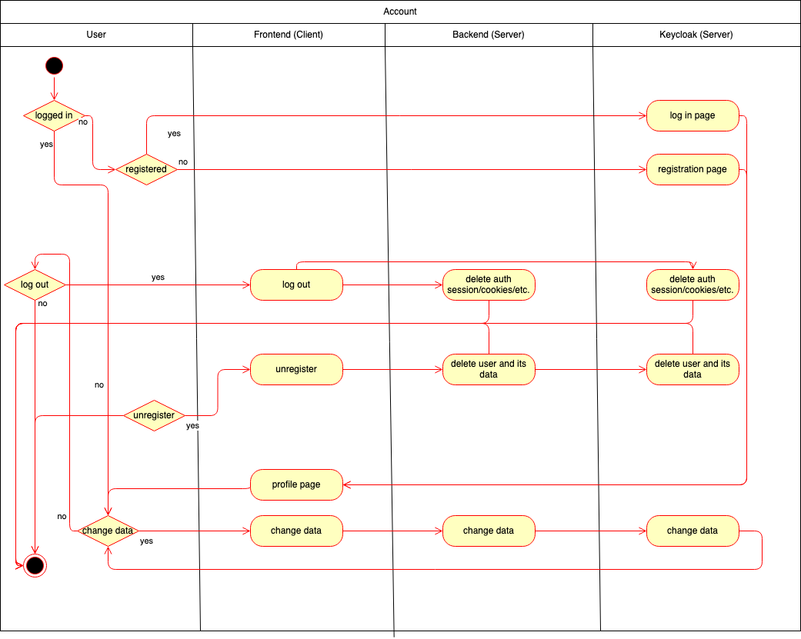
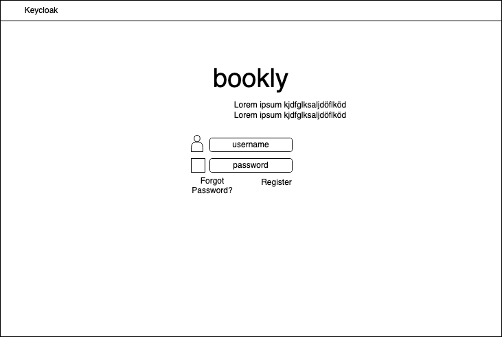

# BOOKLY - Software Requirements Specification
## Use-Case Specification: Account Operations

### 1 Brief Description

This use case describes the (un)registration, login and logout into our web app.

## 2. Flow of Events

### 2.1 Basic flow

In general a user can decide to log in or to register. In the case that one's logged in one can delete its whole account
including the data or to log out.

### 2.2 Login  

When entering our website, the first page that is shown is the login mask. A username and a password is needed. Is the login
successful, one will be redirected to his profile page. Otherwise a error message will show up and he can repeat his login
or register.

### 2.3 Logout

When browsing trough his pages or editing his cover, a user has can select an option in the header of the website.
By clicking on logout, he will be logged out and redirected to the login mask.

TBD Book page with logout option

### 2.4 Register

For registering a username and a mail is needed. If the username is already taken an error message should show up.
To protect against bots, a captcha query is built in. In addition, the general data protection guidelines must be accepted.
After confirmation, an e-mail is generated and sent in which the user activates his account by clicking on the link. 
He will be redirected to the login page and can now log in there.

### 2.5 Delete/Unregister

A user can delete his account including every data of his friendship book by going to his profile and selecting delete. 

