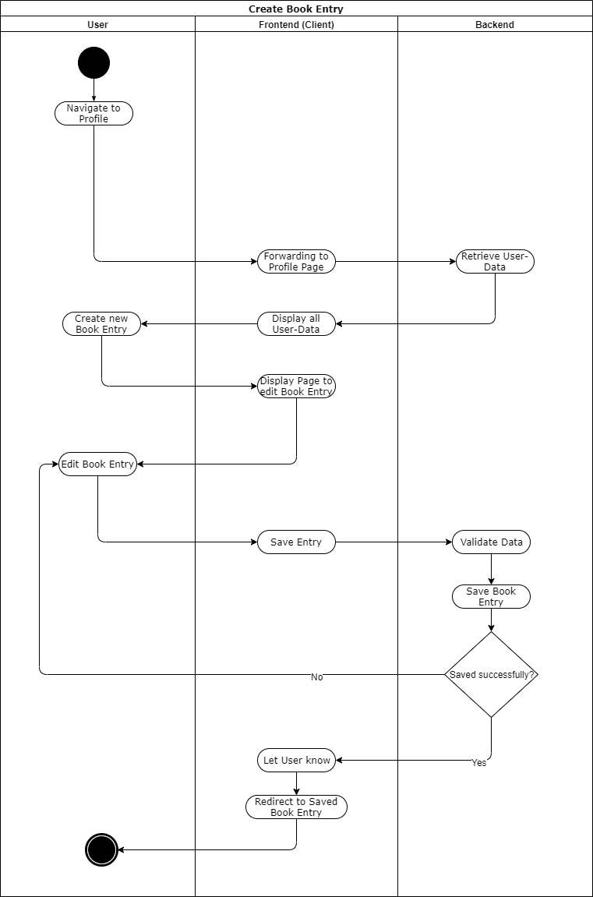

# BOOKLY - Software Requirements Specification
## Use-Case Specification: Create Page

## 1. Use-Case: Create Page

### 1.1 Brief Description

The creation of a new page. The owner of the book has the opportunity to add new pages to his
book. Later this option will lead to a link sharing. For now the adding option will automatically
lead to the new page (a link with the userid and a uuid for this page).

## 2. Flow of Events

## 3. Preconditions

The User either received a link to create a page for a friend, or is logged in to create a page to share with a friend.
