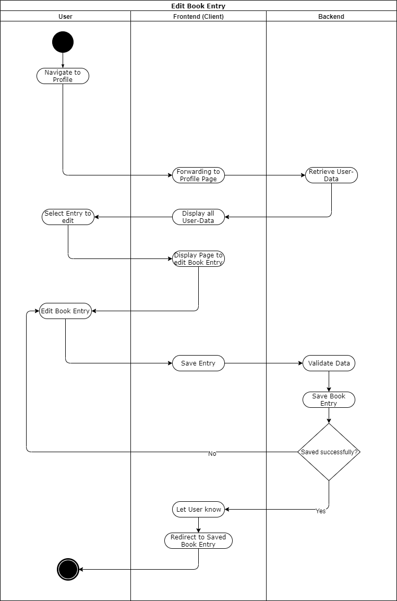

# BOOKLY - Software Requirements Specification
## Use-Case Specification: Edit Page

## 1. Use-Case: Edit Page

### 1.1 Brief Description

A user can edit his page entry (e.g. he wants to change his favorite food from spaghetti to Mac'n'Cheese).

## 2. Flow of Events

## 3. Special Requirements

### 3.1 Link or Account
        
In order to edit a page entry you either have a direct link, or you have an account.

## 4. Preconditions

### 4.1 Entry already created

The page entry to be edited has to be created before in order to edit it.

