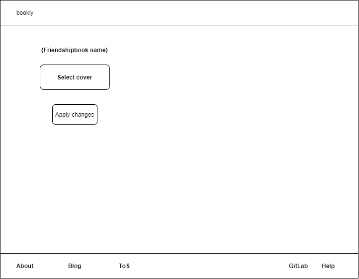
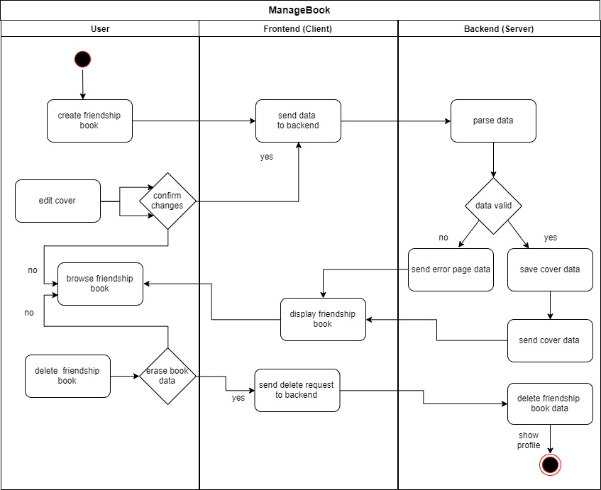

# BOOKLY - Software Requirements Specification
## Use-Case Specification: Manage Book

## 1. Use-Case: Manage Book

### 1.1 Brief Description

This use case describes the creation, reading, updating and deleting of a book(CRUD).
Since the creation and display of a book is more complex, they were defined as separate UseCases and stored 
in separate files. The activity diagram also does not show their functions in detail, but refers to their outsourced activities.

## 2. Flow of Events

For further details for reading, creating and updating pages look into their linked use case specification.

### 2.1 Basic flow

In general a user will create a friendship book cover and enter the data of this cover page. 
You will be able edit/update it later and you are able to delete the friendship book in its entirety. 

### 2.2 Creation  

After registering you have the opportunity to create a friendship book. Once you have created
a new book you can create a personalized book cover. Later the book cover can also be 
designed with different themes. You can decide whether you friendship book will be 
public or private.

[Create Book](design_CreateBook.md "Create Book")

### 2.3 Read

A user can browse through his book. Starting with the cover, he can reach all
entries by clicking on arrows to the right or left on the bottom of the page.
The view of the cover or a page includes a photo or picture, labels and text.

[Read Book](ReadBook.md "Read Book Cover")

### 2.4 Edit

During editing the user can modify his labels and text but also change the picture.

### 2.5 Delete

A friendship book shall only be deleted by the owner. The user can manage his cover within his profile.

## 3. Special Requirements

### 3.1 Owning An Account
        
In order to create a friendship book the user has to have an account. For editing the cover, 
the user has to own the account and view the page. After clicking on the pencil, the user 
will be able to make changes to his cover page.

## 4. Preconditions

### 4.1 The user has to be logged in

To ensure proper privacy of a friendship book the user has to be logged in when working with his book.
He can make his friendship book visible to others if he wants to. Guests can only look inside the book,
not manage it. See the privacy settings in the profile.

## 5. Postconditions

### 5.1 Create

After adding data to the textfields and/or photos, you can save 
your friendship book cover. It will be displayed according to your
privacy settings.

### 5.2 Read

Either only the user who owns the friendship book will have read privileges of their 
friendship book or it will be public and guests will be able to view it. 

### 5.3 Edit

You can edit your book cover as often as you like. You only need to be logged in. If you want to manage your friendship book entries, see the ManagePage UC.

### 5.4 Delete

After confirming the deletion dialog of a book, the book pages will be no longer displayed in the list 
overview and all the book data will be permanently removed from the database.

## 6. Feature Files
[Feature Manage Book](../backend/src/test/resources/dhbw/online/bookly/ManageBook.feature)
