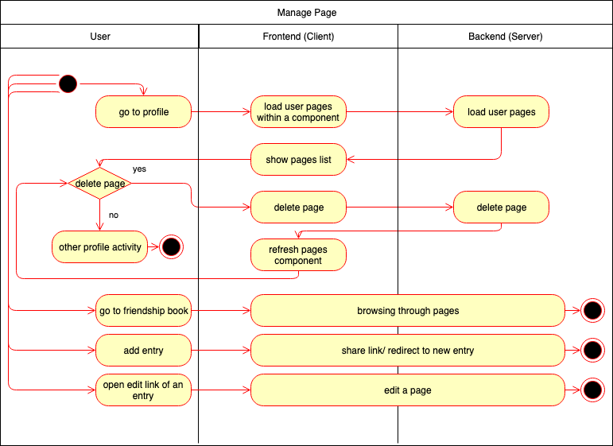

# BOOKLY - Software Requirements Specification
## Use-Case Specification: Manage Page

## 1. Use-Case: Manage Page

### 1.1 Brief Description

This use case describes the creation, reading, updating and deleting of a book page (CRUD).
Since the creation, editing and display of pages are more complex, they were defined as separate UseCases and stored 
in separate files. The activity diagram also does not show their functions in detail, but refers to their outsourced activities.

## 2. Flow of Events

For further details for reading, creating and updating pages look into their linked use case specification.

### 2.1 Basic flow

In general a user will create a friendship book page/ entry and list all inserted data of this specific page. 
One will maybe edit/update it by sharing a specific link to a page or delete it.

### 2.2 Creation  

The creation of a new page. The owner of the book has the opportunity to add new pages to his
book. He will receive a uuid that he can share with anyone else for editing its data. See [ShareLink](sharelink_visibility_invite.md "Share link")

[Create Book Entry](CreatePage.md "Create Book Entry")

### 2.3 Read

A user can view an entry by browsing through his book. (Starting with the cover, he can reach all entries by arrows.)
The functionality to the view of only one page includes a photo, labels, text and further decorations. 
See [ManagePageDecorations](design_Manage_Page_Decorations.md "Manage Page Decorations")

[Read Book Entry](ReadPage.md "Read Book Entry")

### 2.4 Edit

During editing the visitor/writer can modify the text entries but also change the pictures and decorations.
[Edit Book Entry](EditPage.md "Edit Book Entry")

See also [ManagePageDecorations](design_Manage_Page_Decorations.md "Manage Page Decorations") 

### 2.5 Delete

A page entry shall only be deleted by the user itself. The user can manage his pages within his profile.
There he can scroll trough all of his pages and manually delete a page if he wants to.
By deleting his whole account, all pages will be deleted too.

See also [OperateAccount](OperateAccount.md "Operate Account") 

## 3. Special Requirements

### 3.1 Owning An Account
        
In order to create a friendship book the user has to have an account. For editing a page, the user has to create the page
and share it with the friend.

## 4. Preconditions

### 4.1 The user has to be logged in

To ensure proper privacy of a friendship book the user has to be logged in when working with his book.

## 5. Postconditions

### 5.1 Create

After a new page is created, it must be saved in the database and displayed in the list overview.

### 5.2 Read

The user is able to read a page. No changes can be made.

### 5.3 Edit

After a page has been edited by a friend, the data must have been changed in the database and thus when reloaded shown in the list overview.

### 5.4 Delete

After confirming the deletion modal of a page, the page will be permanently removed and no longer displayed in the list 
overview and in the database too.

## 6. Feature Files
[Feature Manage Page](../backend/src/test/resources/dhbw/online/bookly/manage_page.feature)
