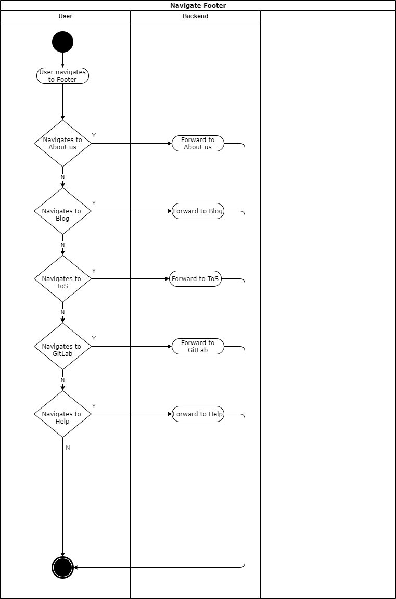

# BOOKLY - Software Requirements Specification
## Use-Case Specification: UC Navigate Footer

## 1. Use-Case: Navigate Footer

### 1.1 Brief Description

There shall always be a footer presented when scrolling to the bottom of a site. With this footer the user shall easily navigate to the following locations:
- About us 
- Blog
- ToS (Terms of Service)
- GitLab
- Help

## 2. Flow of Events

## 3. Preconditions

There are no preconditions, the footer shall be displayed to every visitor of the website