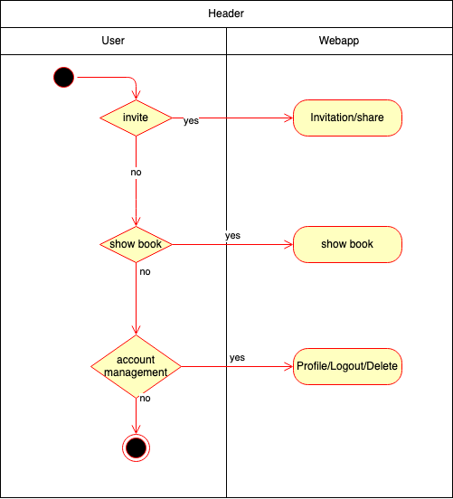

# BOOKLY - Software Requirements Specification
## Use-Case Specification: Navigate Header

### 1 Brief Description

The header is intended to quickly access the main functionality of our webapp.

## 2. Flow of Events

### 2.1 Basic flow

The user can access its profile settings or logout, go to his own friendship book or invite
some friends to look into his book.

See [Account Operations](OperateAccount.md), [Read Book](ReadBook.md) and [sharelink_visibility_invite](sharelink_visibility_invite.md)

## 3. Preconditions

The visitor has to be logged in to see the header.

