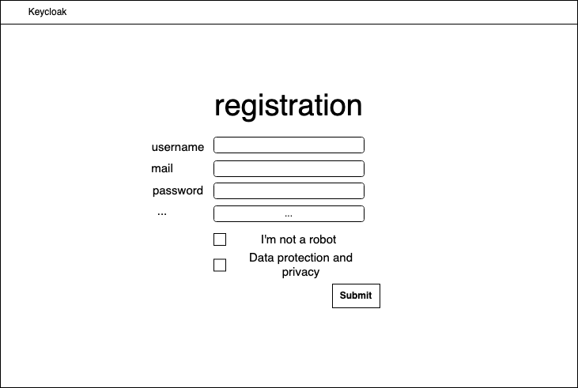
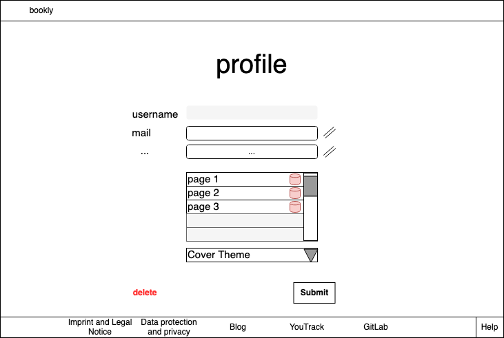

# BOOKLY - Software Requirements Specification
## Use-Case Specification: Operate Account

### 1 Brief Description

This use case describes the (un)registration, login and logout of our web app. For every account flow, we decided to integrate
the identity management solution *Keycloak*. Every protected side will redirect to the running Keycloak instance where it handles
the account requests. This shall have the security advantage that our backend will never see any kind of sensitive credentials
or has to handle and update authentication processes.

## 2. Flow of Events

### 2.1 Basic flow

For accessing protected content, the visitor will be redirected to the login and registration form of keycloak. There
one can login or register the account. After a successful authentication, one will be redirected back to the application.
As one is logged in, one can also change its profile data. For this, a custom user interface shall be implemented and
send the relevant data to Keycloak where it will be updated. If one does not intend to change its data or do anything else on
our application, one can log out or go even further and delete its whole account and data.

### 2.2 Login  

For accessing protected content, the visitor will be redirected to the login form of keycloak. A username and a password is needed, also some personal data.  Is the login
can be requested. Is the login successful, one will be redirected to his profile page. Otherwise a error message will show up and he can repeat his login
or register.

### 2.3 Logout

When browsing trough his pages or editing his cover, a user has can select an option in the header of the website.
By clicking on logout, he will be logged out and redirected to the login mask.

### 2.4 Register

For registering a username and a password is needed, also some personal data. If the username is already taken an error message should show up.
To protect against bots, a captcha query is built in. In addition, the general data protection guidelines must be accepted.
After confirmation, a new account will be created and redirect the user directly to the startpage.

### Account Management
By clicking on the settings in the header, a user can click on profile and edit on its profile page his data. This is a custom
page and no redirection to Keycloak. Every request will be handled in the backchannel and send therefore to Keycloak.
Every personal data is allowed to be changed and updated (but not the username as it is used for the authentication).

A user can also delete his account including every data of his friendship book by going to his profile and selecting delete. 

