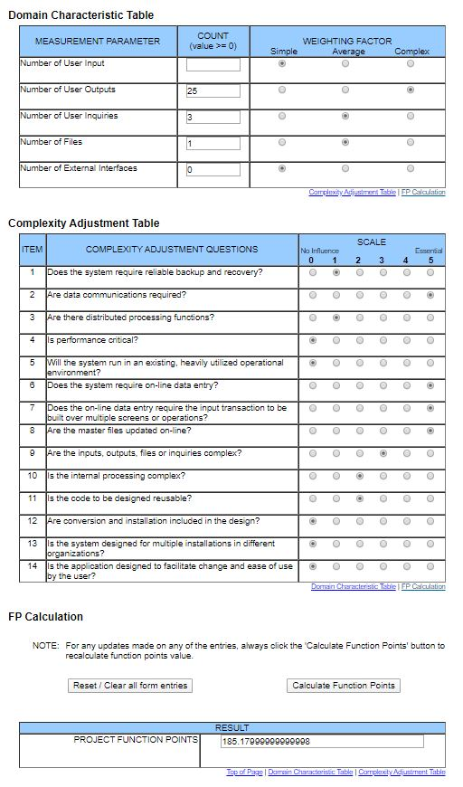

# BOOKLY - Software Requirements Specification
## Use-Case Specification: Read Book

## 1. Use-Case: Read Book

### 1.1 Brief Description

A user can browse through his book. Starting with the cover, he can reach all
entries by clicking on arrows to the right or left on the bottom of the page.
The view of the cover or a page includes a photo or picture, labels and text.

## 2. Flow of Events

## 3. Special Requirements

### 3.1 Owning An Account
        
In order to browse through a friendship book the user has to have an account. After the registration one can create his
book including an own cover and start browsing through his book there.
(BUT: he can make his friendship book visible to others if he wants to. But there one can only look inside the book,
not manage it. See the privacy settings in the profile.)

## 4. Preconditions

### 4.1 The user has to be logged in

To ensure proper privacy of a friendship book the user has to be logged in when working with his book.
(BUT: he can make his friendship book visible to others if he wants to. But there one can only look inside the book,
not manage it. See the privacy settings in the profile.)

## 5. Function Points

