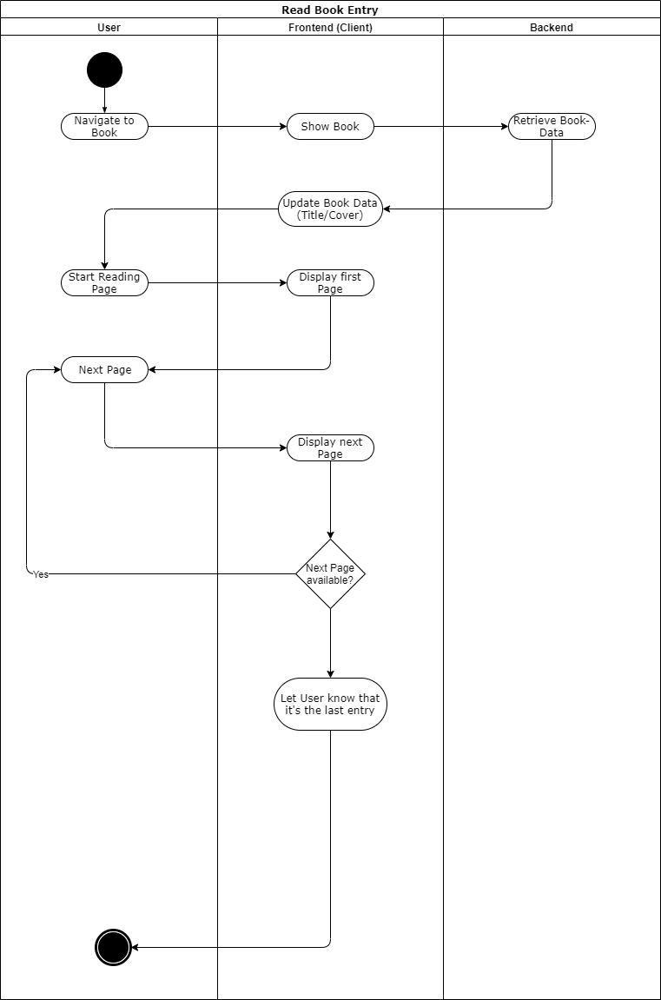
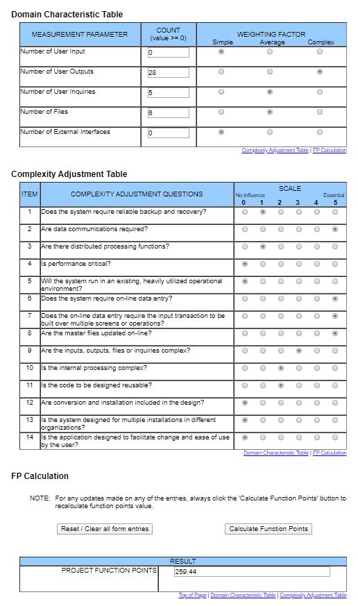

# BOOKLY - Software Requirements Specification
## Use-Case Specification: Read Page

## 1. Use-Case: Read Page

### 1.1 Brief Description

A user can read page entries from his friends.

## 2. Flow of Events

## 3. Special Requirements

### 3.1 Owning An Account
        
In order to browse through the pages (his friendship book) the user has to have an account.

## 4. Preconditions

The user is logged in and has received at least one page entry

## 5. Function Points

