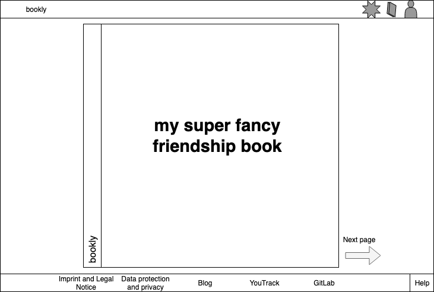
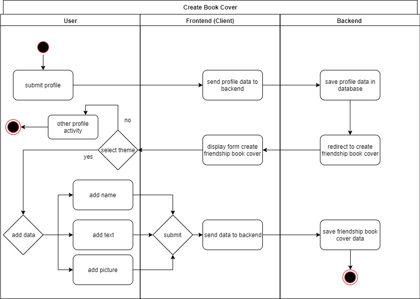

# BOOKLY - Software Requirements Specification
## Use-Case Specification: Create Book

## 1. Use-Case: Create Book

### 1.1 Brief Description

After registering a user will have his own friendship book. It's correlated with his account.

## 2. Flow of Events

## 3. Special Requirements

### 3.1 Owning An Account
        
In order to browse through a friendship book the user has to have an account. After the registration one can add further styles.
See [Design Manage Cover](design_Manage_Cover_Decorations.md "Design Manage Cover").

## 4. Preconditions

### 4.1 The user has to be logged in

To ensure proper privacy of a friendship book the user has to be logged in when working with his book.

## 5. Function Points

