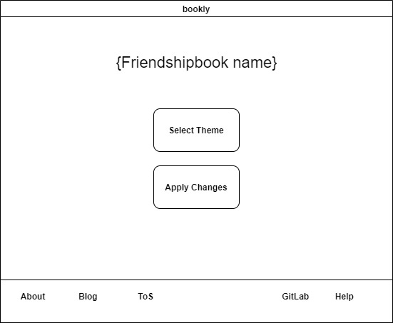
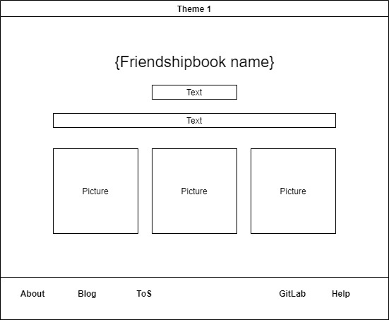
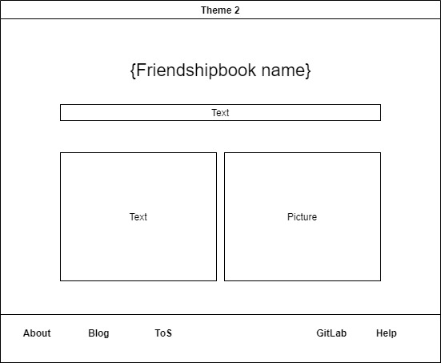
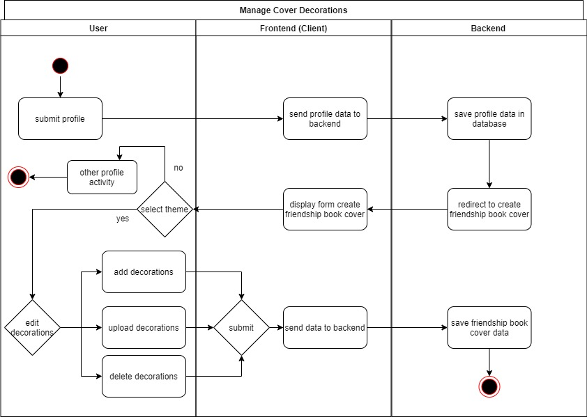

# BOOKLY - Software Requirements Specification
## Use-Case Specification: Manage Cover Decoration

## 1. Use-Case: Manage Cover Decoration

### 1.1 Brief Description

This use case describes the creation, reading, updating and deleting of a cover decoration(CRUD).
This use case extends the functionality of edit/update book entry. It adds the feature to attach stickers to a cover.

## 2. Flow of Events

### 2.1 Basic flow

In general a user will create a friendship book cover and enter the data of this cover page. 
The user will be able to add, edit and delete the decoration. If the friendship book is deleted, it is delete in its entirety. Thus no decoration data will remain. 

### 2.2 Creation  

After registering you have the opportunity to create a friendship book. Once you have created
a new book you can create a personalized book cover. You can add sticker and upload your own. 
The book cover can also be designed with different themes. The themes decide where data can be added to the friendship book cover.
 

### 2.3 Read

A user can view the book cover by browsing through his book.
The functionality to the view of the cover includes the decorations.

### 2.4 Edit

During editing the user can modify his decorations and theme.

### 2.5 Delete

If the user deletes his/her theme, the default theme is displayed. Decoration can be deleted in edit mode.
 
## 3. Special Requirements

### 3.1 Owning An Account
        
In order to create a friendship book the user has to have an account. For editing the cover, 
the user has to own the account and view the page. After clicking on the pencil, the user 
will be able to make changes to his cover page.

## 4. Preconditions

### 4.1 The user has to be logged in

To ensure proper privacy of a friendship book the user has to be logged in when working with his book.
He can make his friendship book visible to others if he wants to. Guests can only look inside the book,
not manage it. See the privacy settings in the profile.

## 5. Postconditions

### 5.1 Create

After adding data to the decorations, you can save 
your friendship book cover. It will be displayed according to your
privacy settings.

### 5.2 Read

Either only the user who owns the friendship book will have read privileges of their 
friendship book or it will be public and guests will be able to view it. 

### 5.3 Edit

You can edit your book cover as often as you like. You only need to be logged in. If you want to manage your friendship book entries, see the ManagePage UC.

### 5.4 Delete

After confirming the deletion of a decoration, the decoration will be permanently removed 
in the database too.

## 6. Function Points

