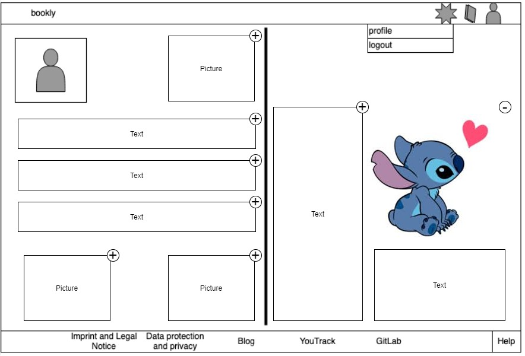
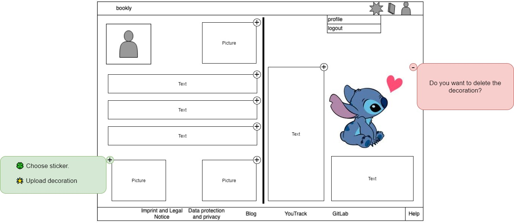
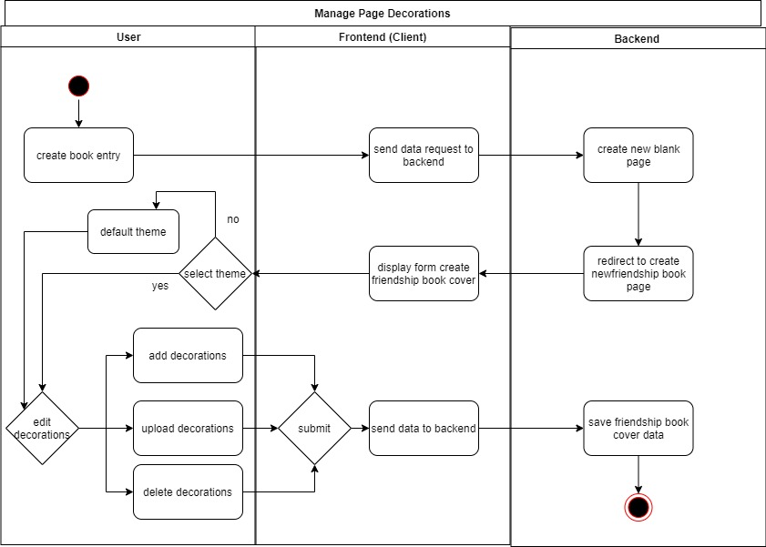
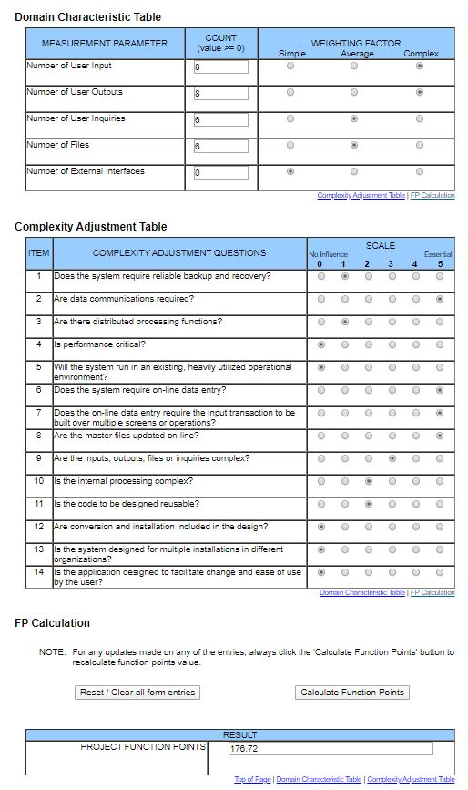

# BOOKLY - Software Requirements Specification
## Use-Case Specification: Manage Page Decoration

## 1. Use-Case: Manage Page Decoration

### 1.1 Brief Description

This use case describes the creation, reading, updating and deleting of decorations on a book page (CRUD).
This use case extends the functionality of edit/update book entry. It adds the feature to attach stickers to a book entry.

## 2. Flow of Events

### 2.1 Basic flow

In general a user will create a friendship book page/ entry and list all inserted data of this specific page. 
One will maybe edit/update it later and from time to time one will delete it.

### 2.2 Creation  

The owner of the book has the opportunity to add new pages to his book by inviting other to contribute.
If a friend designs a page in the friendship book, the friend will be able to choose a theme for
the friendship book page. The themes decide where data can be added to the friendship book page.
A friend will be able to add, edit and delete sticker decorations and upload his/her own stickers.

### 2.3 Read

A user can view an entry by browsing through his book. (Starting with the cover, he can reach all entries by arrows.)
The functionality to the view of only one page includes the decorations.

### 2.4 Edit

During editing the user can modify his decorations and theme.

### 2.5 Delete

If the user deletes his/her theme, the default theme is displayed. Decoration can be deleted in edit mode.
 

## 3. Special Requirements

### 3.1 Owning An Account
        
For editing a page decoration, a friendship book owner has to invite a friend to design and decorate a page.

## 4. Preconditions
 
### 4.1 The user has to be logged in

No applicable. You can design and decorate a page without logging in.

## 5. Postconditions

### 5.1 Create

After a new page decoration is created, it must be saved in the database and displayed in the list overview.

### 5.2 Read

The user is able to read a page. No changes can be made.

### 5.3 Edit

After a page decoration has been edited, the data must have been changed in the database.

### 5.4 Delete

After confirming the deletion of a decoration, the decoration will be permanently removed 
in the database too.

## 6. Function Points

