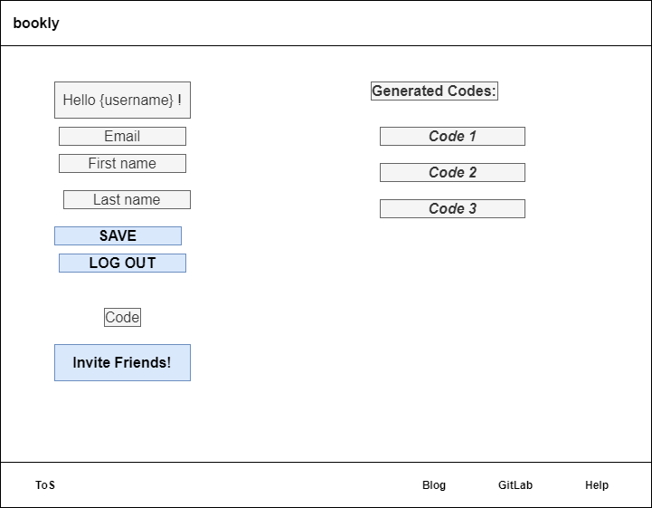
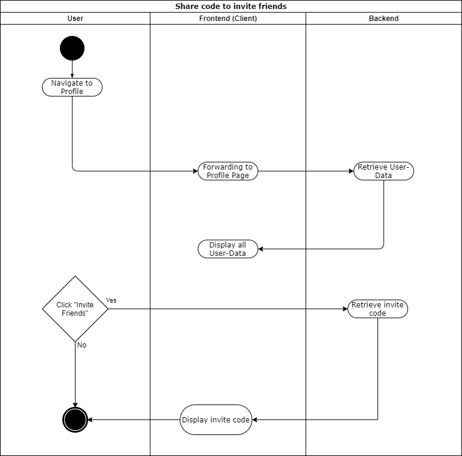
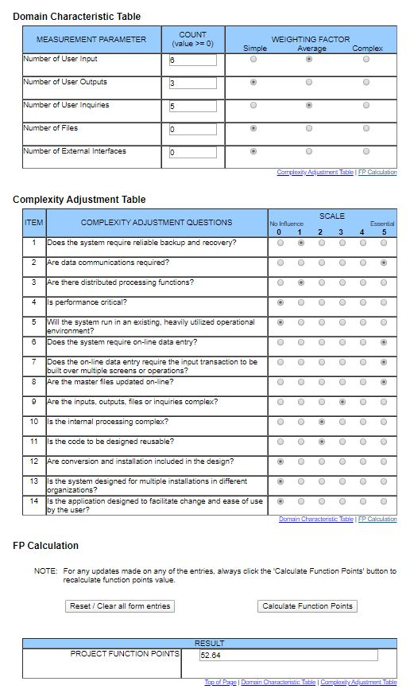

# BOOKLY - Software Requirements Specification
## Use-Case Specification: UC share code to invite friends

## 1. Use-Case: Share code to invite friends

### 1.1 Brief Description

The main focus of this use case is to connect your book with your friends. This is achieved by three main methods:
- Share code to invite friends in order to add more pages to the friendshipbook

## 2. Flow of Events

## 3. Preconditions

The user must be logged in

## 4. Function Points

