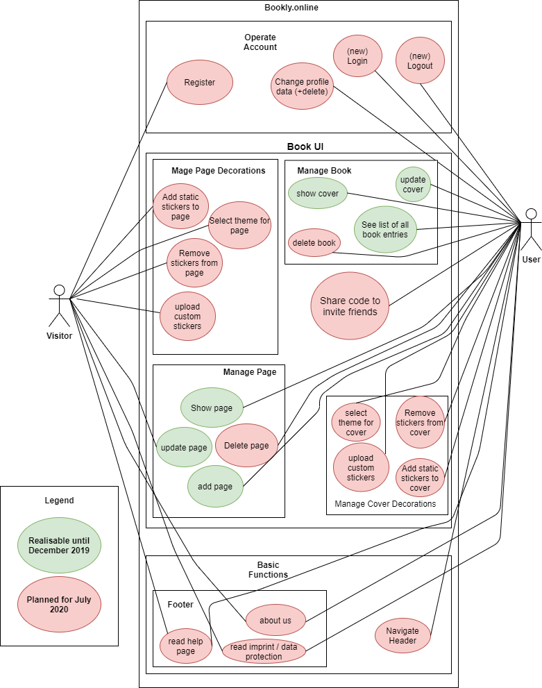

# Bookly - Software Architecture Document

### Version 1.0

# Revision history

| Date       | Version | Description                                          | Author           |
|------------|---------|------------------------------------------------------|------------------|
| 28/11/2019 | 1.0     | Initial Documentation                                | Alexandra Stober |
| 29/05/2020 | 2.0 	   | Update for Final Exam                                                    |                  |

# Table of Contents
- [Introduction](#1-introduction)
    - [Purpose](#11-purpose)
    - [Scope](#12-scope)
    - [Definitions, Acronyms and Abbreviations](#13-definitions-acronyms-and-abbreviations)
    - [References](#14-references)
    - [Overview](#15-overview)
- [Architectural Representation](#2-architectural-representation)
- [Architectural Goals and Constraints](#3-architectural-goals-and-constraints)
- [Use-Case View](#4-use-case-view)
- [Logical View](#5-logical-view)
    - [Overview](#51-overview)
    - [Architecturally Significant Design Packages](#52-architecturally-significant-design-packages)
- [Process View](#6-process-view)
- [Deployment View](#7-deployment-view)
- [Implementation View](#8-implementation-view)
    - [Overview](#81-overview)
    - [Layers](#82-layers)
- [Data View](#9-data-view)
- [Size and Performance](#10-size-and-performance)
- [Quality/Metrics](#11-qualitymetrics)

## 1. Introduction

### 1.1 Purpose

This document provides a comprehensive architectural overview of the system, using a number of different architectural 
views to depict different aspects of the system. It is intended to capture and convey the significant architectural 
decisions which have been made on the system.

### 1.2 Scope

This document describes the technical architecture of the bookly project, including module structure and dependencies as 
well as the structure of classes.

### 1.3 Definitions, Acronyms and Abbreviations

| Abbreviation | Description                            |
| ------------ | -------------------------------------- |
| API          | Application programming interface      |
| MVC          | Model View Controller                  |
| REST         | Representational state transfer        |
| SDK          | Software development kit               |
| SRS          | Software Requirements Specification    |
| UC           | Use Case                               |
| VCS          | Version Control System                 |
| N/A          | Not Applicable                         |

### 1.4 References

| Reference                                                                        						    | Date       |
|-----------------------------------------------------------------------------------------------------------|------------|
| <a href="https://blog.bookly.online/">Bookly Blog</a>                         						    | 28/10/2019 |
| <a href="https://gitlab.com/project_bookly/bookly">GitLab Repository</a>         				            | 28/10/2019 |
| <a href="https://nicoschinacher.myjetbrains.com/youtrack/issues?q=project:%20bookly">YouTrack</a>			| 28/10/2019 |

### 1.5 Overview

This document contains the architectural representation, goals and constraints as well as logical, deployment, 
implementation and data views.

## 2. Architectural Representation

Our project bookly uses the classic MVC structure as follows:

## 3. Architectural Goals And Constraints

As our main technology we decided to use Spring MVC, which is a framework that takes not only care of the backend but 
also of the frontend. Besides the controller and model language is Java, so that we do not have to care about 
serialization. 

## 4. Use-Case View

This is our overall use-case diagram:

## 5. Logical View

### 5.1 Overview

We split our architecture according to the MVC architecture as follows:

Spring uses a Dispatcher Servlet that accepts requests and forwards to the view resolver. 
This resolver serves our view files. See steps 1, 6, 7 and 8. This is our controller according to the MVC model.

The backend serves as the model according to the MVC model.

The frontend serves as the view according to the MVC model.

### 5.2 Architecturally Significant Design Packages

We have a backend and a frontend module. The backend module contains our model. The frontend module contains our view. 
The Spring MVC framework is realized. The controller cannot directly access the database. 

## 6. Process View

N/A

## 7. Deployment View

This is our deployment view:

This is our deployment process. Our code is hosted on GitLab. To be deployed,
it is build as JAR (or as Dockerimage). The Files will be copyed on our server
and for stage run exposed on port 8080 or on dev on port 7070.
We are using the Apache2 webserver as reverse proxy and link the ports on the intended domain.
If a visitor wants to log in, every authentication request is redirected to the running Keycloakinstance.

## 8. Implementation View

N/A

## 9. Data View

Our data view is modelled as followed:

## 10. Size and Performance

N/A

## 11. Quality/Metrics

To ensure a high quality we are using continuous integration. It automatically builds, tests, 
measures and deploys the application, if the respective previous step has not failed. This happens periodically and when 
changes are pushed to a branch. When merging the master branch into the deployment branch, the application will 
automatically be deployed as well after pushing the button.

For serving a most current documentation of our API, we are using Swagger. It is an open-source software framework backed by a large ecosystem of tools that helps developers 
design, build, document, and consume RESTful web services. It is accessible at PATH/swagger-ui.html.
It's also possible to test an API and see all possible responses.

## 12. Patterns

Behavioral design patterns are design patterns that 
identify common communication patterns between objects
and realize these patterns.We decided to go with the 
Null Object Design Pattern. The intent of a Null Object
is to encapsulate the absence of an object by providing 
a substitutable alternative that offers suitable default 
do nothing behavior.

As we have various pictures and stickers, we decided to
use the Null Object Design Pattern to implement our
DummyImage. It allows us the abstract handling of null 
away from the client. Apart from that the refactoring 
enables us to get rid of some code duplication.

Before Design Pattern:

Excerpt before Design Pattern:

After Design Pattern:

Excerpt after Design Pattern:

The Pattern can be found in the highlighted classes:

